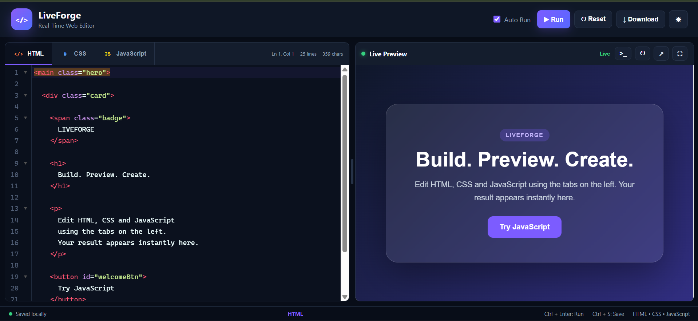

# LiveForge — Real-Time HTML, CSS & JavaScript Editor

LiveForge is a free and open-source **real-time HTML, CSS and JavaScript editor** with instant live preview. It is a browser-based **live code editor**, **JavaScript playground**, and lightweight **web development IDE** built with CodeMirror.

Write HTML, style pages with CSS, run JavaScript, inspect console output, and preview results instantly — directly in the browser.

## Live Demo

Try LiveForge directly in your browser:

https://anu261105.github.io/realtime-html-css-javascript-editor/

## Features

- Real-time HTML, CSS and JavaScript editing
- Instant live preview
- Separate HTML, CSS and JavaScript editor tabs
- Syntax highlighting with CodeMirror
- Line numbers and code folding
- Auto-closing HTML tags
- Auto-closing brackets
- Integrated JavaScript console
- JavaScript runtime error capture
- Automatic local storage persistence
- Auto Run and manual Run modes
- Draggable editor and preview panels
- Dark and light themes
- Fullscreen preview
- Open preview in a new browser tab
- Download project as a complete HTML file
- Keyboard shortcuts
- Responsive interface

## Screenshot



> LiveForge provides a browser-based development workspace with dedicated HTML, CSS and JavaScript editors, instant live preview, syntax highlighting and an integrated console.

## What is LiveForge?

LiveForge is a browser-based real-time web code editor designed for frontend development and experimentation. It combines independent HTML, CSS and JavaScript editors into a single interactive workspace.

The application automatically combines code from all three editors and renders the generated document inside a sandboxed preview iframe.

## Why Use LiveForge?

LiveForge can be useful for:

- Testing HTML snippets
- Experimenting with CSS styles
- Running JavaScript in the browser
- Learning frontend web development
- Building quick UI prototypes
- Practicing HTML, CSS and JavaScript
- Testing small web components
- Demonstrating frontend concepts
- Creating browser-based coding experiments

## Tech Stack

- HTML5
- CSS3
- JavaScript ES6+
- CodeMirror 5
- Browser Local Storage API
- iframe `srcdoc`
- Window `postMessage` API
- GitHub Pages

## How the Real-Time Editor Works

LiveForge maintains three independent editors:

- HTML Editor
- CSS Editor
- JavaScript Editor

When the code runs, LiveForge dynamically combines the HTML markup, CSS styles and JavaScript logic into a complete HTML document.

The generated document is rendered inside a sandboxed iframe using the browser `srcdoc` API.

Console messages and JavaScript runtime errors are forwarded from the preview iframe to the main application through the `postMessage` API.

## Project Structure

```text
realtime-html-css-javascript-editor/
├── assets/
│   ├── images/
│   └── screenshots/
├── index.html
├── style.css
├── script.js
├── README.md
├── LICENSE
├── robots.txt
└── .gitignore

## Getting Started

### Clone the Repository

Clone the project using Git:

```bash
git clone https://github.com/Anu261105/realtime-html-css-javascript-editor.git
```

### Open the Project

Navigate into the project directory:

```bash
cd realtime-html-css-javascript-editor
```

### Run Locally

Open `index.html` directly in a modern web browser or use the Live Server extension in VS Code.

No npm installation, backend server, or build process is required.

## Keyboard Shortcuts

| Shortcut | Action |
|---|---|
| `Ctrl + Enter` | Run code |
| `Ctrl + S` | Save code locally |
| `Ctrl + F` | Search within the active editor |

## Browser-Based JavaScript Console

LiveForge includes an integrated JavaScript console capable of displaying:

- `console.log()`
- `console.info()`
- `console.warn()`
- `console.error()`
- Runtime JavaScript errors
- Unhandled Promise rejections

## Security

User-generated code is rendered inside a sandboxed iframe to help isolate the preview environment from the main editor interface.

## Roadmap

- [ ] Multiple saved projects
- [ ] Project naming and rename support
- [ ] Import and export projects
- [ ] Responsive device preview modes
- [ ] Starter templates
- [ ] Shareable
